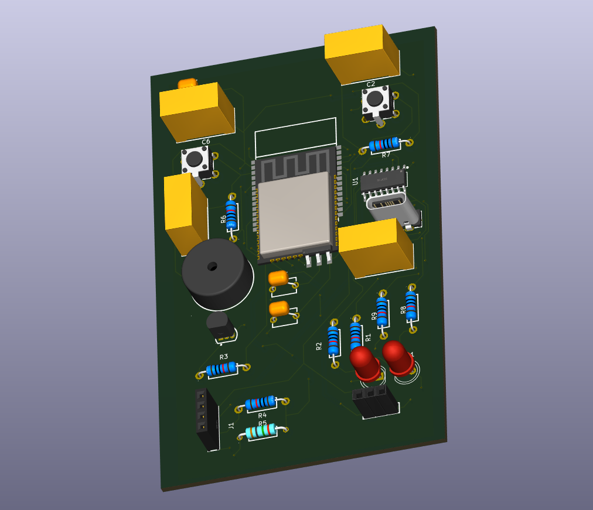
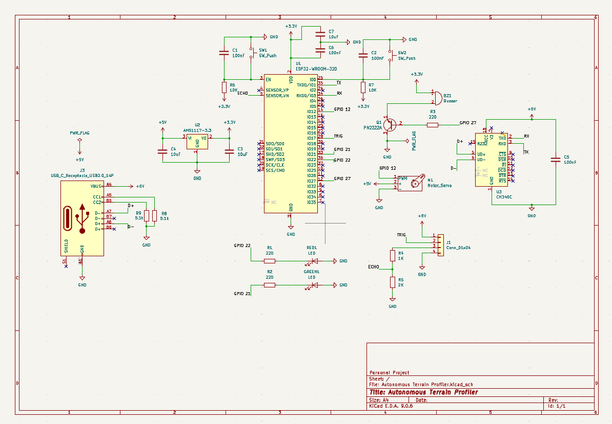
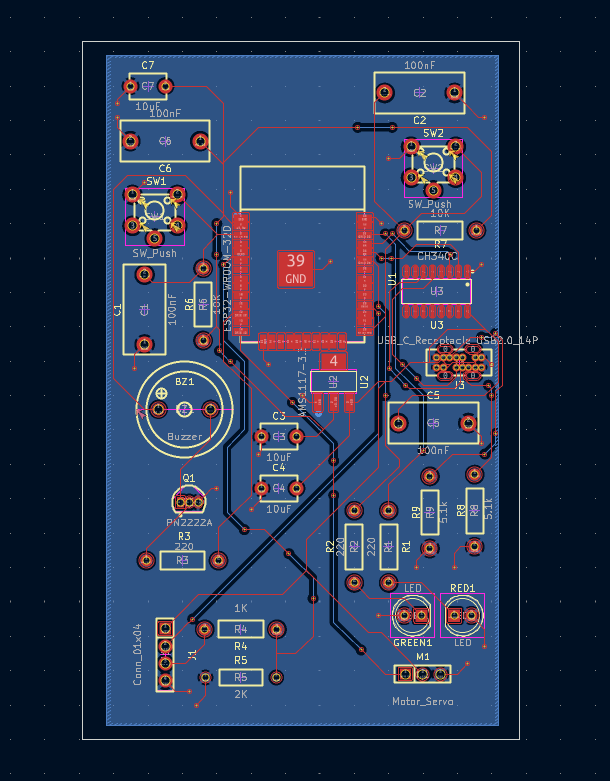

## Autonomous Terrain Profiler

Servo-mounted ultrasonic obstacle-detection system on a custom 2-layer PCB. Sweeps a 180 degree arc with an HC-SR04, flags close objects with a buzzer + LEDs.

## Overview

**MCU:** ESP32-WROOM-32D (bare module, custom board — not a dev board)
**Sensor:** HC-SR04 ultrasonic, mounted on a servo for continuous bidirectional 180 degree sweep
**Alerts:** Transistor-switched (PN2222A) LEDs and passive buzzer, threshold-based proximity warnings
**PCB:** Custom 2-layer board designed from schematic to layout in KiCad

## Hardware

- **ESP32-WROOM-32D** — Bare module, GPIO-safe pin allocation (avoided strapping pins 0/2/5/12/15 and flash pins 6–11)
- **CH340C** — USB-UART bridge for programming, manual boot/reset via EN/GPIO0 buttons
- **AMS1117-3.3** — Voltage regulator, SOT-223, 10µF in/out caps
- **USB-C connector** — SHOU HAN TYPE-C 14-pin THT, 5.1kΩ CC1/CC2 pull-downs
- **HC-SR04** — Echo line level-shifted 5V→3.3V via 1kΩ/2kΩ voltage divider
- **Servo** — PWM control, GPIO12
- **PN2222A (x2)** — NPN low-side switches for buzzer (GPIO27) and LEDs (GPIO21/22)

All footprints sourced from LCSC part numbers and pulled into KiCad via the easyeda2kicad CLI tool for exact manufacturer-match footprints.

## Firmware

Written in C++ (Arduino framework). Core logic:

ESP32Servo for sweep positioning
HCSR04_ESP for ultrasonic timing/distance
Threshold-based alert logic (buzzer/LED) tied to sweep angle and distance

See firmware/terrain_profiler.ino.

## Hardware Design Files

Complete KiCad schematic and PCB layout in hardware/. The board was fully designed and verified for manufacturability (footprints checked, DRC clean) but not fabricated, the project's firmware and sweep logic were validated on a breadboard prototype instead.

## Author

Cameron Nix — Electrical and Computer Engineering, Oregon State University
